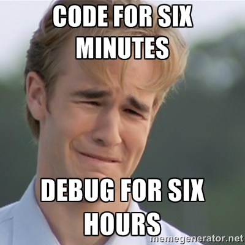

# PHP CLEAN CODE CONCEPT

Versi Bahasa Indonesia

Terkadang kita perlu untuk memahami pentingnya konsep penulisan code yang baik dan mudah dibaca.
Hal ini untuk meminimalisir bentrok, kebingungan, dan masalah2 lainnya didalam teamwork.

[PART 1 : Penamaan Variable](example/penamaan_variable.php) |
[Cek Penjelasan di Youtube](https://youtu.be/QR6pypR_zWA)

[PART 2 : Penggunaan Variable](example/penggunaan_variable.php) | 
[Cek Penjelasan di Youtube](https://youtu.be/1_YY6-HzDg8)

[PART 3 : Control Structure](example/control_structure.php) | 
[Cek Penjelasan di Youtube](https://youtu.be/ZcSUjfs6j-E)

[PART 4 : Function](example/function.php)

